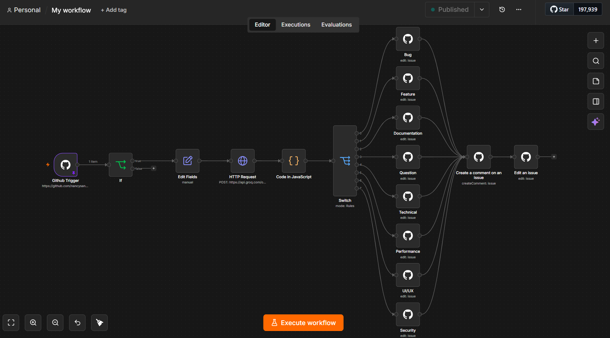

# 🤖 AI GitHub Issue Automation

An AI-powered GitHub issue triage and automation system built using **n8n workflows** and **Groq LLM**.

The system automatically analyzes newly created GitHub issues, classifies them using AI, applies relevant labels, generates helpful comments, and assigns issues to maintainers — reducing manual issue management effort.

---

# 🚀 Features

## ✅ AI Issue Classification

Uses Groq LLM to analyze GitHub issue title and description.

The AI extracts:

- Issue category
- Priority level
- Recommended action

Supported categories:

- Bug
- Feature
- Technical
- Documentation
- UI/UX
- Performance
- Security
- Question


## ✅ Automatic GitHub Labels

Based on AI classification, issues are automatically labeled.

Examples:

```
Bug → bug
Feature → feature
Security → security
Documentation → documentation
```


## ✅ AI Generated Issue Comments

The workflow automatically posts an AI-generated analysis comment on the GitHub issue.

Example:

```
🤖 AI Issue Analysis

Category: Authentication

Priority: High

Recommendation:
Investigate server-side issue causing login failure.
```


## ✅ Automatic Issue Assignment

Issues are automatically assigned to the repository maintainer after classification.

The assignee is dynamically fetched from the repository owner information, making the workflow reusable across repositories.


## ✅ Event Driven Automation

The complete pipeline runs automatically whenever a new GitHub issue is created using GitHub Webhooks.


---

# 🏗️ Architecture

```
GitHub Issue Created
          |
          ↓
GitHub Webhook Trigger
          |
          ↓
Extract Issue Data
          |
          ↓
Groq AI Classification
          |
          ↓
Parse AI Response
          |
          ↓
Category Based Routing
          |
          ↓
Automatic Label Assignment
          |
          ↓
AI Generated Comment
          |
          ↓
Issue Assignment
```

---

# 🛠️ Tech Stack

| Technology | Purpose |
|------------|---------|
| n8n | Workflow automation engine |
| Groq LLM | AI issue classification |
| GitHub API | Issue management and automation |
| GitHub Webhooks | Event triggering |
| Docker | Local deployment |
| JavaScript | Workflow data processing |


---

# 📂 Project Structure

```
ai-github-issue-automation/

│
├── n8n/
│   └── workflows/
│       ├── issue-trigger.json
│       ├── ai-classifier.json
│       ├── auto-label.json
│       ├── auto-comment.json
│       └── auto-assign.json
│
├── docs/
│   ├── architecture.md
│   ├── workflows.md
│   ├── setup.md
│   └── troubleshooting.md
│
├── images/
│   └── workflow screenshots
│
├── README.md
└── docker-compose.yml
```

---

# ⚙️ Workflow Components

| Component | Description |
|-|-|
| GitHub Trigger | Receives new issue events |
| Edit Fields | Extracts required issue information |
| Groq API | Performs AI analysis |
| Code Node | Parses AI JSON response |
| Switch Node | Routes issues by category |
| GitHub Label Node | Adds relevant labels |
| GitHub Comment Node | Posts AI recommendations |
| GitHub Assign Node | Assigns issue owner |


---

# 📊 Current Progress

## Completed

- [x] GitHub webhook integration
- [x] Issue data extraction
- [x] Groq LLM integration
- [x] AI issue classification
- [x] Category based routing
- [x] Automatic GitHub labels
- [x] AI generated comments
- [x] Automatic issue assignment


## Upcoming

- [ ] Multiple AI-generated labels
- [ ] Smarter issue prioritization
- [ ] Discord/Slack notifications
- [ ] Google Sheets issue analytics
- [ ] Production logging
- [ ] Error monitoring workflow


---

# 🔄 Future Enhancements

## Multiple Label Intelligence

Generate multiple labels using AI:

Example:

```
Bug
↓
bug
authentication
backend
high-priority
```


## Smart Assignment

Assign issues based on:

- Category
- Team ownership
- Maintainer workload


## Analytics Dashboard

Store issue data:

- Category trends
- Priority distribution
- Resolution time
- Issue volume


---

# 🧪 Example

Input GitHub Issue:

```
Title:
Login page crashes

Description:
Users cannot login after password reset.
Getting server error.
```

AI Output:

```json
{
  "category": "Bug",
  "priority": "High",
  "comment": "Investigate authentication service failure."
}
```

Result:

```
Issue Label:
bug

Comment:
AI generated analysis

Assignee:
Repository owner
```

---

# 📸 Workflow Preview


---

# 🚀 Setup

See:

- [Setup Guide](docs/setup.md)
- [Workflow Documentation](docs/workflows.md)
- [Architecture](docs/architecture.md)
- [Troubleshooting](docs/troubleshooting.md)


---

# 🎯 Project Highlights

- Built an end-to-end AI automation pipeline using n8n
- Integrated LLM-based decision making into GitHub workflows
- Automated repetitive issue management tasks
- Designed reusable event-driven architecture
- Implemented AI-assisted developer workflow automation


---

# 📄 License

MIT License
