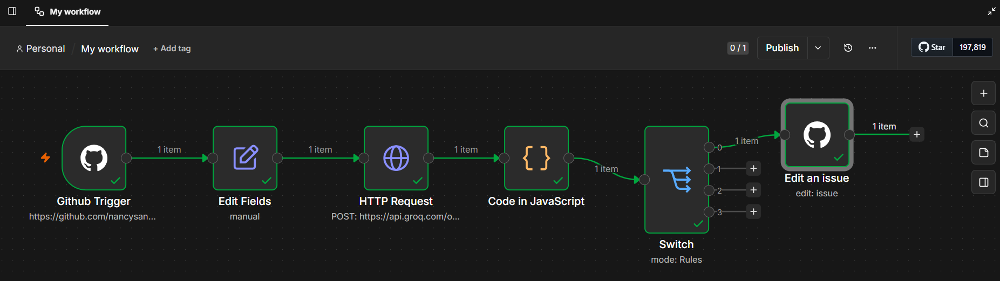

# GitHub Issue AI Automation Workflow

## Overview

This workflow automates GitHub issue triage using AI and n8n.

## Current Workflow

The AI-powered GitHub Issue Classifier follows this automated workflow:

```text
[GitHub Issue Created]
          ↓
[GitHub Trigger]
          ↓
[Extract Issue Data]
          ↓
[Groq LLM Analysis]
          ↓
[Parse AI JSON Response]
          ↓
[Switch Node]
          ↓
[Automatically Add GitHub Label]
```


---

## Implemented Features

### 1. GitHub Trigger

- Listens for newly created GitHub issues.
- Receives webhook payload automatically.

---

### 2. Issue Data Extraction

Extracts:

- Issue title
- Issue description
- Repository name
- Repository owner
- Issue number

---

### 3. AI Classification

The issue is sent to the Groq API using the Llama 3.3 70B Versatile model.

Example output:

```json
{
  "category": "Authentication",
  "priority": "High",
  "comment": "Investigate server-side issue causing login page crash after password reset"
}
```

---

### 4. Routing

A Switch node routes issues based on the AI category.

Current implemented route:

Authentication → Bug

---

### 5. Automatic Labeling

Authentication issues automatically receive the `bug` label using the GitHub API.

---

## Current Status

✅ GitHub Trigger

✅ AI Classification

✅ Automatic Bug Labeling

⬜ AI Comments

⬜ Auto Assignment

⬜ Notifications

⬜ Google Sheets Logging
